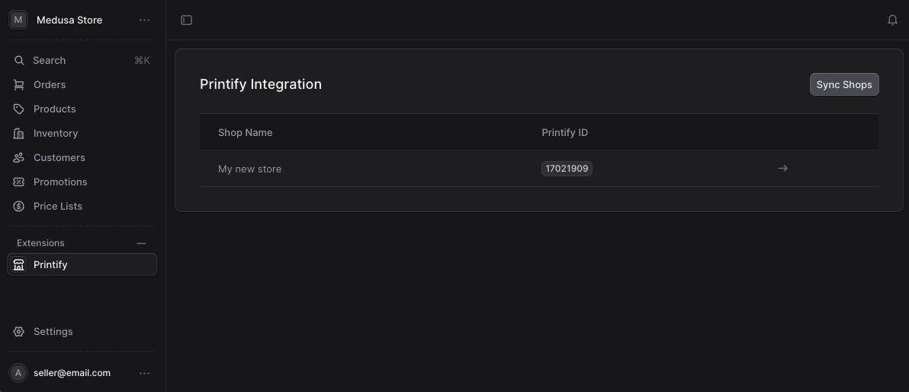
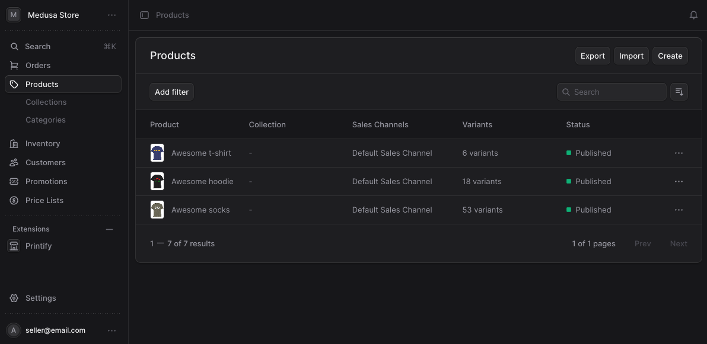

<h1 align="center">medusa-plugin-printify</h1>

<p align="center">
  Print-on-demand fulfillment for <a href="https://medusajs.com">Medusa v2</a>, powered by <a href="https://printify.com">Printify</a>.
</p>

<p align="center">
  <a href="https://www.npmjs.com/package/medusa-plugin-printify"></a>
  <a href="https://www.npmjs.com/package/medusa-plugin-printify"></a>
  <a href="LICENSE"></a>
  <a href="https://github.com/greedychipmunk/medusa-plugin-printify/actions/workflows/ci.yml"></a>
  <a href="https://codecov.io/gh/greedychipmunk/medusa-plugin-printify"></a>
  <a href="https://medusajs.com"></a>
  <a href="https://www.typescriptlang.org/"></a>
</p>

<p align="center">
  <a href="#quick-start">Quick start</a> ·
  <a href="#configuration">Configuration</a> ·
  <a href="#api-reference">API</a> ·
  <a href="CHANGELOG.md">Changelog</a> ·
  <a href="CONTRIBUTING.md">Contributing</a>
</p>

---

## Why this plugin

- **Real fulfillment, not just sync.** Automatic order submission, real-time webhook status, and a Medusa Admin widget that surfaces production state on every order page.
- **Type-safe, tested, CI-driven.** TypeScript strict mode, Jest coverage, and OIDC-signed npm releases driven by conventional-commit PR titles.
- **Decoupled and unopinionated.** No storefront assumptions; works with any Medusa v2 host application.

## Features

- **Product sync** — pull your Printify catalog into Medusa on a schedule or on-demand.
- **Order fulfillment** — automatically submit Medusa orders to Printify when they are placed.
- **Webhook handling** — real-time status updates (shipped, in-production, delivered, etc.).
- **Admin UI** — manage shops, browse synced products, and monitor order status from the Medusa Admin.
- **Webhook auto-registration** — registers all required Printify webhook topics on startup.

## Screenshots

> Screenshots coming soon — see [`docs/screenshots/`](docs/screenshots).

| Printify dashboard | Synced products | Order detail widget |
|---|---|---|
|  |  |  |

## Quick start

```bash
pnpm add medusa-plugin-printify
```

Add to `medusa-config.ts`:

```ts
import { defineConfig } from "@medusajs/framework/utils"

export default defineConfig({
  plugins: [
    {
      resolve: "medusa-plugin-printify",
      options: {
        apiKey: process.env.PRINTIFY_API_KEY,
        webhookSecret: process.env.PRINTIFY_WEBHOOK_SECRET,
        shopId: process.env.PRINTIFY_SHOP_ID,
        webhookBaseUrl: process.env.PRINTIFY_WEBHOOK_URL,
      },
    },
  ],
})
```

Run migrations:

```bash
pnpm medusa db:migrate
```

Done. See [Configuration](#configuration) for all options.

---

## Table of contents

- [Requirements](#requirements)
- [Installation](#installation)
- [Configuration](#configuration)
- [Local Development](#local-development)
- [Production Deployment](#production-deployment)
- [API Reference](#api-reference)
- [Order Fulfillment Flow](#order-fulfillment-flow)
- [Admin Dashboard](#admin-dashboard)
- [Contributing](#contributing)
- [Security](#security)
- [License](#license)

---

## Requirements

- Node.js >= 20
- Medusa >= 2.12.4
- A [Printify account](https://printify.com) with a personal access token

---

## Installation

In your Medusa application directory:

```bash
pnpm add medusa-plugin-printify
```

---

## Configuration

### 1. Add environment variables

Add the following to your Medusa application's `.env`:

```bash
PRINTIFY_API_KEY=your_printify_personal_access_token
PRINTIFY_WEBHOOK_SECRET=your_webhook_secret
PRINTIFY_SHOP_ID=your_printify_shop_id        # optional, but required for order submission
PRINTIFY_WEBHOOK_URL=https://your-domain.com  # base URL for webhook registration (no trailing slash)
```

To find your **API key**: go to [printify.com/app/account/api](https://printify.com/app/account/api) and generate a personal access token.

To find your **shop ID**: call `GET https://api.printify.com/v1/shops.json` with your API key.

The **webhook secret** is a string you choose — Printify will use it to sign webhook payloads so you can verify they are genuine.

### 2. Register the plugin in `medusa-config.ts`

```ts
import { defineConfig } from "@medusajs/framework/utils"

export default defineConfig({
  // ... other config
  plugins: [
    {
      resolve: "medusa-plugin-printify",
      options: {
        apiKey: process.env.PRINTIFY_API_KEY,
        webhookSecret: process.env.PRINTIFY_WEBHOOK_SECRET,
        shopId: process.env.PRINTIFY_SHOP_ID,
        webhookBaseUrl: process.env.PRINTIFY_WEBHOOK_URL,
      },
    },
  ],
})
```

All available options:

| Option | Type | Required | Description |
|---|---|---|---|
| `apiKey` | `string` | Yes | Printify personal access token |
| `webhookSecret` | `string` | Yes | Secret used to verify webhook signatures |
| `shopId` | `string` | No | Printify shop ID — required for order submission and webhook registration |
| `webhookBaseUrl` | `string` | No | Base URL of your Medusa server (e.g. `https://api.mystore.com`) — required for webhook registration |
| `enableNotifications` | `boolean` | No | Emit Medusa notification events for Printify order status changes |
| `notificationEmail` | `string` | No | Email address to receive Printify fulfillment notifications |

### 3. Run database migrations

In your Medusa application directory:

```bash
pnpm medusa db:migrate
```

This creates the `printify_shop`, `printify_product`, and `printify_order` tables.

---

## Local Development

### Prerequisites

- [Docker](https://www.docker.com) (for the local PostgreSQL instance)
- pnpm

### Plugin setup

Clone this repository and install dependencies:

```bash
git clone https://github.com/greedychipmunk/medusa-plugin-printify
cd medusa-plugin-printify
pnpm install
```

Copy the environment template and fill in your values:

```bash
cp .env.template .env
```

Start the local PostgreSQL instance:

```bash
docker compose up -d
```

Generate the plugin's database migrations:

```bash
pnpm medusa plugin:db:generate
```

Publish the plugin to the local [Yalc](https://github.com/wclr/yalc) registry so your Medusa application can install it:

```bash
pnpm medusa plugin:publish
```

### Link to a local Medusa application

In your Medusa application directory, install the locally published plugin:

```bash
pnpm medusa plugin:add medusa-plugin-printify
```

Run migrations in the Medusa application:

```bash
pnpm medusa db:migrate
```

### Watch for changes

In the plugin directory, start the dev watcher — changes are automatically pushed to the local Yalc registry and picked up by your Medusa application:

```bash
pnpm dev
```

### Run tests

```bash
pnpm test              # all tests
pnpm test -- --watch   # watch mode
```

---

## Production Deployment

### 1. Build the plugin

```bash
pnpm build
```

### 2. Publish to npm

Releases are handled automatically by `.github/workflows/release.yml` when a PR with a conventional-commit title (`feat:`, `fix:`, or `feat!:`) is merged to `main`. There is no manual `npm publish` step.

### 3. Install in your Medusa application

```bash
pnpm add medusa-plugin-printify
```

### 4. Set environment variables on your server

Ensure the following are set in your production environment:

```bash
PRINTIFY_API_KEY=...
PRINTIFY_WEBHOOK_SECRET=...
PRINTIFY_SHOP_ID=...
PRINTIFY_WEBHOOK_URL=https://api.your-production-domain.com
```

### 5. Run migrations

```bash
pnpm medusa db:migrate
```

### 6. Configure your reverse proxy

The plugin exposes a webhook endpoint at `POST /webhooks/printify`. Ensure this path is reachable from the public internet so Printify can deliver webhook events. No authentication is needed on this route — the plugin verifies the `x-pfy-signature` HMAC header internally.

On startup, the plugin automatically registers all required webhook topics with Printify using the `webhookBaseUrl` you configured.

---

## API Reference

All admin routes require authentication. Storefront routes are public.

### Admin routes

| Method | Path | Description |
|---|---|---|
| `GET` | `/admin/printify/shops` | List all synced Printify shops |
| `POST` | `/admin/printify/shops` | Trigger a shop sync from Printify |
| `GET` | `/admin/printify/products` | List synced products (supports `?shop_id=` filter) |
| `POST` | `/admin/printify/products` | Trigger a product sync from Printify |
| `GET` | `/admin/printify/orders` | List Printify orders (supports `?status=` and `?medusa_order_id=` filters) |
| `POST` | `/admin/printify/orders/:id/submit` | Manually submit a Printify order to production |

### Webhook endpoint

| Method | Path | Description |
|---|---|---|
| `POST` | `/webhooks/printify` | Receives Printify webhook events |

**Handled events:** `order:status-changed`, `order:shipped`, `order:sent-to-production`, `order:shipment:delivered`, `product:updated`, `product:deleted`, `shop:disconnected`

---

## Order Fulfillment Flow

1. A customer places an order in your Medusa storefront.
2. The `order.placed` subscriber detects any line items with `metadata.printify_product_id`.
3. A Printify order is created and submitted to production automatically.
4. Printify sends webhook events as the order moves through production and shipping.
5. The plugin updates the local Printify order record and emits Medusa events for each status change.
6. The Printify order widget on the Medusa Admin order detail page reflects the current status.

---

## Admin Dashboard

The plugin adds two pages and one widget to the Medusa Admin:

- **Printify** (sidebar) — lists synced shops with a one-click sync button.
- **Printify › Products** — browse all synced products with search and a sync button.
- **Order detail widget** — appears below the order details on any order page, showing the linked Printify order status and a manual submit button for pending orders.

---

## Contributing

PRs welcome. See [CONTRIBUTING.md](CONTRIBUTING.md) for setup. PR titles must follow [Conventional Commits](https://www.conventionalcommits.org/) — the release workflow uses them to bump versions automatically.

## Security

See [SECURITY.md](SECURITY.md) for how to report vulnerabilities.

## License

MIT &copy; Dawson Blackhouse
